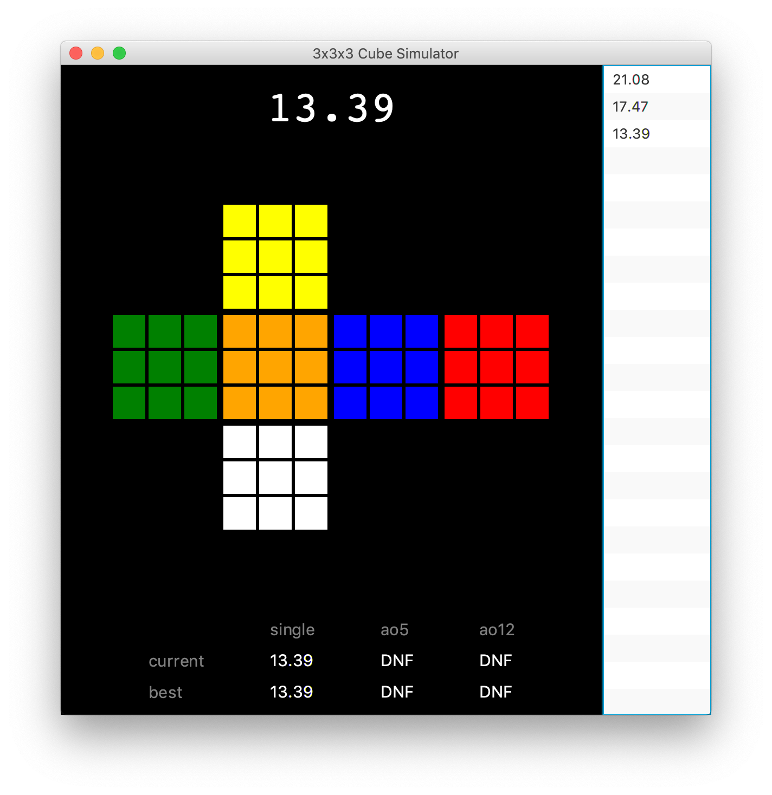

# 3x3x3 Cube Simulator

A desktop application of a virtual 3x3x3 Rubik's Cube simulator, which can be scrambled and solved, with the solve being timed and inspection being tracked. Initially a one-day project, I decided to spend more time and add extra functionality to it. This simulator is written in Java with JavaFX.

## Functionality
As of now, the net of the cube is displayed and redrawn everytime a move is made, along with statistics (best and current single, average of 5 and average of 12) which are updated after every solve. The list of times is also displayed. 

The cube can be scrambled by hitting the Spacebar, which applies a random-move scramble and starts inspection. The cube can be rotated during inspection but once a turn is made, the timer starts. If inspection is between 15 and 17 seconds, a +2 penalty is awarded, if it is past 17 seconds, the solve is marked as a DNF.

A solve can be stopped at any time by pressing the Escape key which marks it as a DNF and resets the cube. The session can be cleared by hitting Backspace, which clears the list of times and the statistics.

This is all the functionality as of now! I may extend on this in the future.

## Requirements
You need to have <a href="https://www.oracle.com/technetwork/java/javase/downloads/index.html">Java Runtime Environment (JRE)</a> installed to run this app.

## Download
To download this simulator, navigate to the "Releases" tab and download the .jar file. Double-click it to open the app. Enjoy!

## Key Controls
The controls for manipulating the cube are equivalent to those on csTimer (and those on other popular cube simulators as well, as far as I know).

| Moves | R | R' | L | L' | U | U' | D | D' | F | F' | B | B' | x | x' | y | y' | z | z' |
|:----:|:-:|:--:|:-:|:--:|:-:|:--:|:-:|:--:|:-:|:--:|:-:|:--:|:-:|:--:|:-:|:--:|:-:|:--:|
|  Key | I |  K | D |  E | J |  F | S |  L | H |  G | W |  O | Y |  B | ; |  A | P |  Q |

There are extra controls to start the timer, clear the session and stop the current solve, which are as follows:

|                 Behaviour                 |    Key    |
|:-----------------------------------------:|:---------:|
|     Scramble cube and start inspection    |  SpaceBar |
| Stop the current solve, marking it as DNF |   Escape  |
|             Clear the session             | Backspace |
